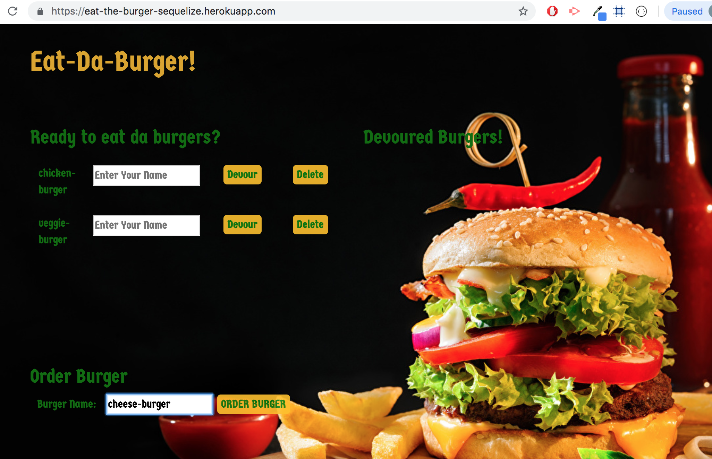
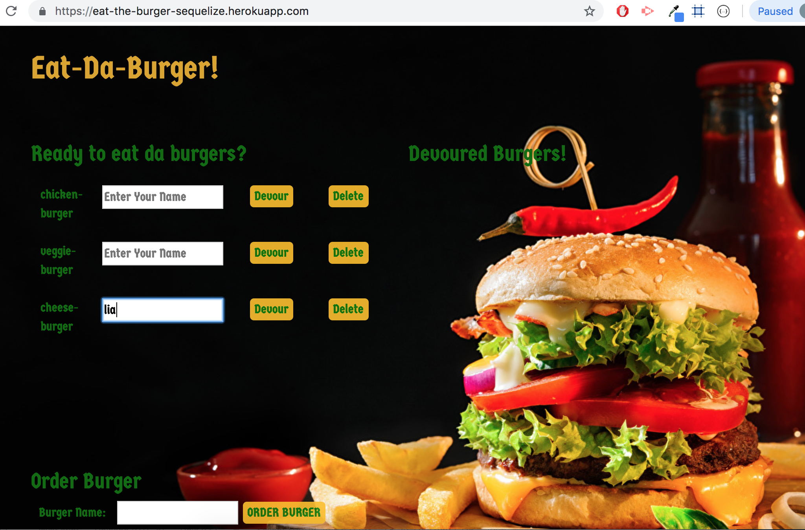
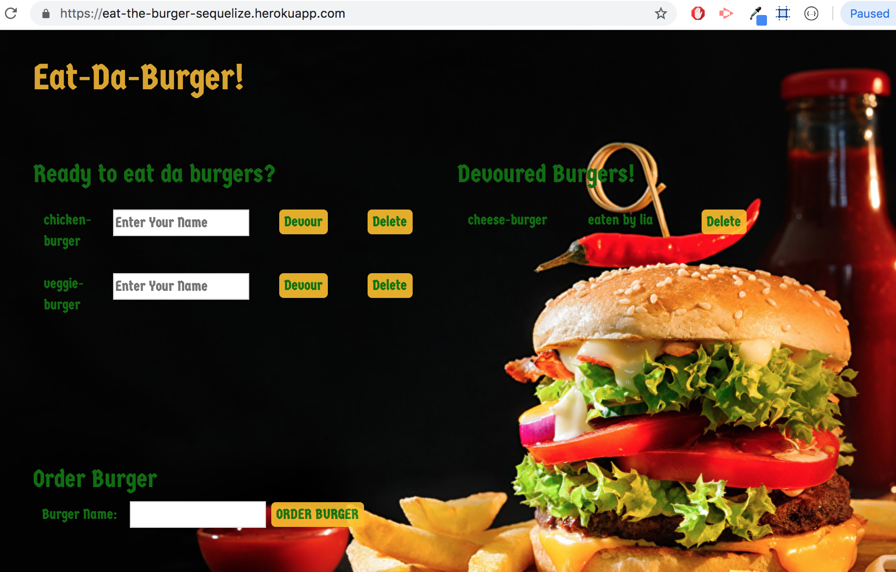

# :hamburger: Eat-Da-Burger-Sequelize-App

### Overview
---
*   It is a restaurant app that lets customers input the names of burgers they'd like to eat and also their names with the devoured burgers.

* Whenever a customer submits a burger's name, the app will display the burger on the left side of the page -- waiting to be devoured.

* Each burger in the waiting area also has a `Devour` button. Customer can enter their names. When the customer clicks it, the burger will move to the right side of the page along with their name.

* The app will store every burger in a database, whether devoured or not.

* The app uses sequelize joins to get the datas from different tables.

### Getting Started
---
* Clone down repo ``` git clone git@github.com:liaswapna/Eat-Da-Burger-Sequelize.git```.
* Navigate to the repo ```cd Eat-Da-Burger-Sequelize```.
* Run command ```npm install``` in Terminal or GitBash
* Run command ```node server``` to start ther server.

### Technologies Used
---
* HTML5
* CSS3
* Bootstrap
* Node.js
* Express
* Express-handlebars
* mysql
* Sequelize
* jawsDB

### Dependencies
---
```js
{
"dotenv": "^6.2.0",
"express": "^4.16.4",
"express-handlebars": "^3.0.0",
"mysql": "^2.16.0",
"mysql2": "^1.6.4",
"sequelize": "^4.42.0"
}
```

### Demos
---
* Eat-Da-Burger-App
    * [Heroku Link](https://eat-the-burger-sequelize.herokuapp.com/)

### Screenshots
---
* #### Heroku deployed App View
    * Order-burger button adds the burger into the database.
    

    * Devour button helps to devour it. The name field helps to add the name of the person who wants to eat it.
    

    * The devoured burger is displayed on the right side along with the name. Delete button deletes the burger.
    
